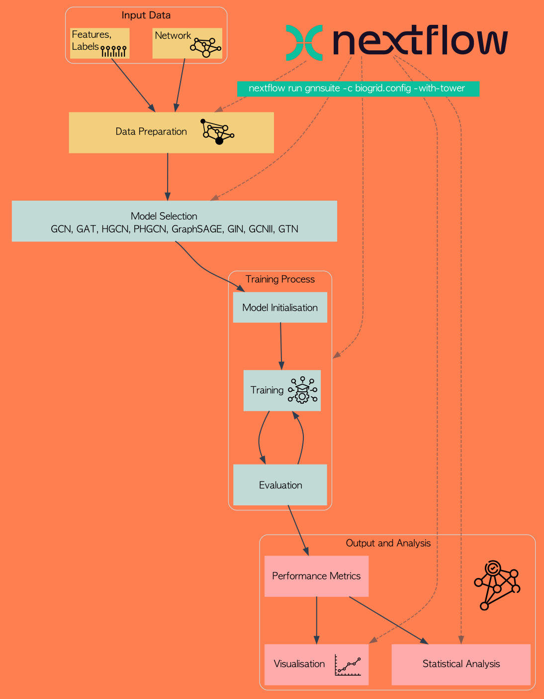

# gnn-suite


We design and create a framework for benchmarking and comparing Graph Neural Network (GNN) architectures implemented in a robust and reproducible way using the scientific workflow system Nextflow, popular with computational biologists. We include support for nine different GNN architectures on binary node classification tasks. To demonstrate the versatility of our framework, we consider a task of significant biological importance - that of identifying cancer-driver genes (CDG) in a protein-protein interaction (PPI) network. Data was sourced from the Pan-Cancer Analysis of Whole Genomes (PCAWG), the Pathway Indicated Drivers (PID), the COSMIC Cancer Gene Census (COSMIC-CGC), and STRING and BioGRID PPI databases. On this task, GNNs were able to effectively make use of the network structure of the data. Nevertheless, different architectures performed remarkably similar, emphasising the importance of the quality of the training data for such tasks. We make our pipeline publically available to enable other researchers to perform similar investigations into other areas of computational biology. We believe that this will lead to improved benchmarking standards in the GNN literature.

## Models

The following models are included:

- Graph Convolutional Networks (GCN)
- Graph Attention Networks (GAT) 
- Hierarchical Graph Convolutional Networks (HGCN)
- Parallel Hierarchical Graph Convolutional Networks (PHGCN)
- Graph SAmpling and aggreGatE (GraphSAGE) 
- Graph Transformer Networks (GTN) 
- Graph Isomorphism Networks (GIN)
- Graph Convolutional Networks II (GCNII) 

## Architecture





## Running the workflow

### Install or update the workflow

```bash
nextflow pull stracquadaniolab/gnn-suite
```

### Run a test

```bash
nextflow run stracquadaniolab/gnn-suite -profile docker,test
```

### Run an experiment

```bash
nextflow run stracquadaniolab/gnn-suite -profile docker,<experiment_file>
```

## Docker Image
 
[View the `gnn-suite` Docker image on GitHub Container Registry](https://github.com/orgs/stracquadaniolab/packages/container/package/gnn-suite), you can also download it using:

```bash
docker pull ghcr.io/stracquadaniolab/gnn-suite:latest
```

## Adding a New Experiment

1. **Create a Config File**: Create a new configuration file `<experiment_file>.config` with the parameters for the experiment:
    ```groovy
    // profile to test the string workflow
    params {
      resultsDir = "${baseDir}/results/"
      networkFile = "${baseDir}/data/<network_file>.tsv"
      geneFile = "${baseDir}/data/<feature_file>.csv"
      epochs = [300]
      models = ["gcn2", "gcn", "gat", "gat3h", "hgcn", "phgcn", "sage", "gin", "gtn"]
      replicates = 10
      verbose_interval = 1
      dropout = 0.2
      alpha = 0.1
      theta = 1
      dataSet = "<cexperiment_file_tag>"
    }
    ```

2. **Update `base.config`**: Add a new profile for your experiment in `base.config`:
    ```groovy
    profiles {
      // existing profiles...

      // test profile for the biogrid cosmic network defining some data
      <config_file> {
        includeConfig '<experiment_file>.config'
      }
    }
    ```

3. **Run the Experiment**: Execute the pipeline with the new profile using:
    ```bash
    nextflow run main.nf -profile docker, <experiment_file>
    ```

    or
    ```bash
    nextflow run stracquadaniolab/gnn-suite -profile docker,<experiment_file>
    ```

## Adding a New Model

1. **Create Model**: Implement the new model class in `models.py`:
    ```python
    class NewModel(torch.nn.Module):
        def __init__(self, num_features, num_classes, num_hidden=16, num_layers=2, dropout=0.5):
            super(NewModel, self).__init__()
            # Define layers
        def forward(self, data):
            # Define forward pass
    ```

2. **Import Model**: Add your model to the imports in `gnn.py`:
    ```python
    from models import GCN, GAT, ..., NewModel
    ```

3. **Update `build_model`**: Add your model to the `build_model` function in `gnn.py`:
    ```python
    elif name == "new_model":
        return NewModel(num_features, num_classes, dropout=dropout)
    ```

4. **Include in Experiment**: Add the new model name to the `models` list in your experiment config (`<experiment_file>.config`):
    ```groovy
    models = ["gcn", "gat", ..., "new_model"]
    ```

## FAQ
In case:
```groovy
Command error:
  .command.sh: line 2: ../gnn-suite/bin/plot.py: Permission denied
```
Give permission to run:
```groovy
 chmod +x /home/<path>/code/gnn-suite/bin/plot.py
```
## Paper

- Forthcoming

## Authors

- Sebestyén Kamp
- Ian Simpson
- Giovanni Stracquadanio


